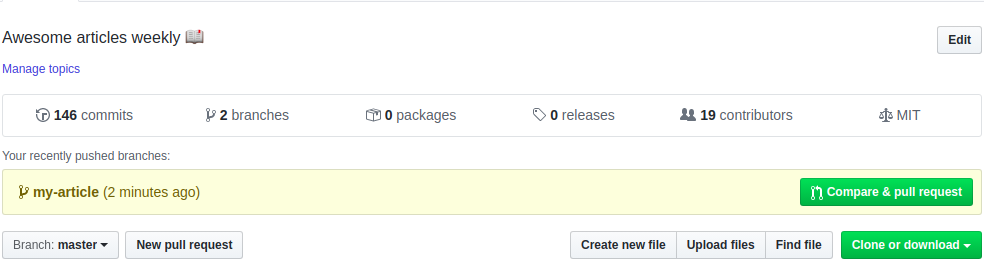
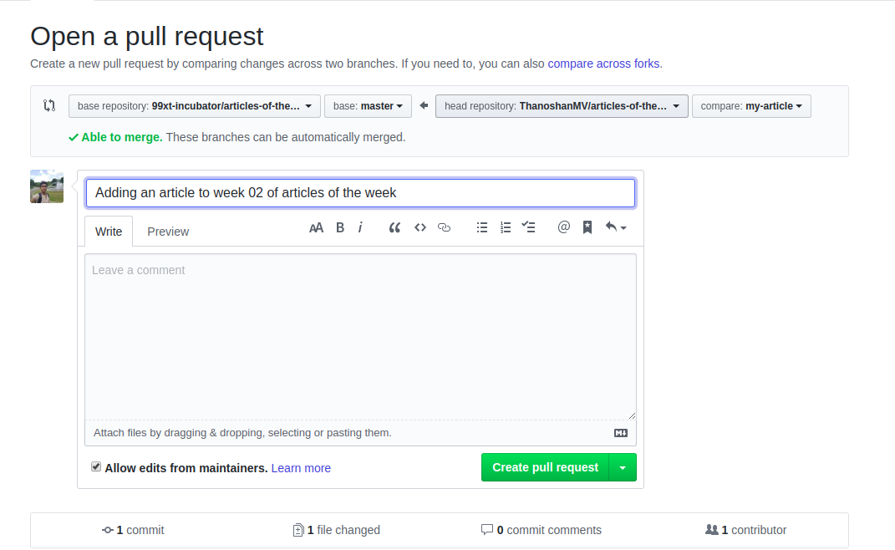

<h1 align = 'center' >ТРПО. Самостоятельная работа</h1>

# Самостоятельная работа №1

- [Самостоятельная работа №1](#самостоятельная-работа-1)
  - [Задание](#задание)
    - [Задание 1](#задание-1)
    - [Задание 2](#задание-2)
    - [Задание 3](#задание-3)
    - [Задание 4](#задание-4)
    - [Задание 5](#задание-5)
    - [Задание 6 (обязательное)](#задание-6-обязательное)
  - [Требования по выполнению заданий](#требования-по-выполнению-заданий)
    - [Требования по работе с Git/GitHub](#требования-по-работе-с-gitgithub)
      - [Fork](#fork)
      - [Clone](#clone)
      - [Commit](#commit)
      - [Push](#push)
      - [Pull Request](#pull-request)
    - [Требования по оформлению кода](#требования-по-оформлению-кода)
      - [Именование переменных](#именование-переменных)
      - [Работа с операторами](#работа-с-операторами)

---

## Задание 

### Задание 1

Составить программу, которая будет считывать введённое целое число. После чего, каждую цифру этого числа необходимо вывести в новой строке. 1 балл

### Задание 2

Составить программу, которая по введенному номеру дня недели будет выводить его название. Нумерация дней недели начинается с 1 – понедельник, 2 — вторник и т. д. 1 балл 

### Задание 3

Написать программу, которая будет принимать два целых числа **n** и **k** и возвращает число, содержащее ***k*** первых цифр числа ***n***. 2 балла 

### Задание 4

Написать программу, которая должна определить, пройдёт ли параллелепипед в отверстие. Размеры отверстия и габариты параллелепипеда (длина, высота, ширина) вводятся пользователем. 2 балла 

### Задание 5

Написать программу, которая будет угадывать пароль. Пароль состоит из 4 цифр (не четырёхзначное число). Необходимо, чтобы программа угадала его. Символы для пароля генерируются случайно. После того как программа угадала пароль, он выводится на экран. 3 балла

### Задание 6 (обязательное)

Теория. Ответить на мои вопросы на следующем практическом занятии (оценка за терию + оценка за практику / 2 = итоговая оценка)

## Требования по выполнению заданий

### Требования по работе с Git/GitHub

#### Fork

Делаем Fork моего репозитория к себе. Для того, чтобы это сделать, зайдите на страницу проекта и нажмите кнопку «Создать ответвление» («Fork»), которая расположена в правом верхнем углу.

#### Clone

После того, как сделали к себе Fork проекта, необходимо сделать его Clone к себе на компьютер. После того как проект скачался, создаём в папке проект, в котором выполняются задания.

#### Commit

Для каждого задания выполняется отдельный commit. Т.е. после того, как задание выполнено, необходимо сделать commit. В описании commit указывается выполненое здание. Именование commit должно соответствовать требованиям указанным в *[практическом задании 1](https://github.com/Virotor/SDT/blob/main/Task-1.md#%D1%82%D1%80%D0%B5%D0%B1%D0%BE%D0%B2%D0%B0%D0%BD%D0%B8%D1%8F-%D0%BF%D0%BE-%D0%B8%D0%BC%D0%B5%D0%BD%D0%BE%D0%B2%D0%B0%D0%BD%D0%B8%D1%8E-commit)*.

Если commit'ов будет меньше, чем заданий, для задания не будет отдельного commit или они будут выполнены неправильно, будут отниматься баллы

#### Push 

После того, как закончили работу и выполнили задания, делаем Push в репозиторий.

#### Pull Request

После того как проект загружен в ваш репозиторий на GitHub, делаем Pull Request. 
Чтобы создать Pull Request, переходим на страницу вашего форка. Справа от выпадающего меню с выбором ветки есть кнопка «New pull request» либо же кнопка «Compare & pull request».

Затем указываем ваше ФИО и группу.

 Ждём ответа с оценкой от меня. 

### Требования по оформлению кода

#### Именование переменных

Для именования переменных, функций, пространств имён использовать camel Case. В camelCase имя должно начинаться со строчной буквы, а первая буква каждого последующего слова в имени должна быть заглавной. Все слова при этом пишутся слитно между собой.
Пример camelCase для переменной camel case var – camelCaseVar.

Все константы выносятся в глобальное пространство, желательно в отдельное пространство имён. Для глобальных переменных и констант использовать Upper case + snake case. 
Пример UPPER_CASE_SNAKE_CASE для переменной upper case snake case var – UPPER_CASE_SNAKE_CASE_VAR.

У переменных и функций должно быть осмысленное название, которое отражает для чего используется данная переменная. Объявление переменных должно быть возле места, где они используются в первый раз.

Выводить значение выражения без предварительного присваивания к переменной нельзя.

#### Работа с операторами

Страемся заменять множественное if-else на оператор switch case. Циклы жилательно офрмлять в едином стиле. т.е., если два цикла, то оба либо for, либо while, либо do while.

Делать меню для выбора задания не надо.

